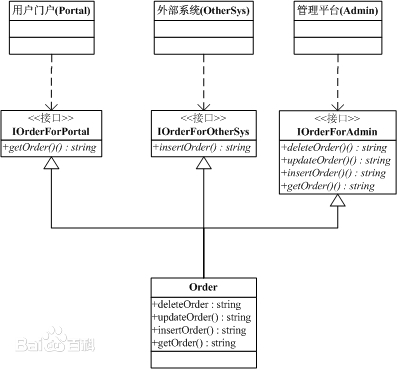

# 接口隔离原则

### 概述

> 客户端不应该依赖它不需要的接口。一个类对另一个类的依赖应该建立在最小的接口上。

- 使用多个专门的接口比使用单一的总接口要好。

- 一个类对另外一个类的依赖性应当是建立在最小的接口上的。

- 一个接口代表一个角色，不应当将不同的角色都交给一个接口。没有关系的接口合并在一起，形成一个臃肿的大接口，这是对角色和接口的污染。

- “不应该强迫客户依赖于它们不用的方法。接口属于客户，不属于它所在的[类层次结构](https://baike.baidu.com/item/类层次结构/4685758)。”这个说得很明白了，再通俗点说，不要强迫客户使用它们不用的方法，如果强迫用户使用它们不使用的方法，那么这些客户就会面临由于这些不使用的方法的改变所带来的改变。

### 示例

使用场合，提供调用者需要的方法，屏蔽不需要的方法，满足接口隔离原则。比如说电子商务的系统，有订单这个类，有三个地方会使用到：

- 一个是门户，只能有查询方法；

- 一个是外部系统，有添加订单的方法；

- 一个是管理后台，添加删除修改查询都要用到。

根据接口隔离原则(ISP)，一个类对另外一个类的依赖性应当是建立在最小的接口上。

也就是说，对于门户，它只能依赖有一个查询方法的接口。

UML图：



代码：

```java
interface IOrderForPortal{
    String getOrder();
}
interface IOrderForOtherSys{
    String insertOrder();
    String getOrder();
}
interface IOrderForAdmin{ //extendsIOrderForPortal,IOrderForOtherSys
    String deleteOrder();
    String updateOrder();
    String insertOrder();
    String getOrder();
}
// --这儿不用接口继承,因为可能出现修改了父接口影响了子接口
/*
interface IOrderForPortal{
    String getOrder();
}
interface IOrderForOtherSys{
    String insertOrder();
}
interface IOrderForAdmin extends IOrderForPortal,IOrderForOtherSys{
    String updateOrder();
    String deleteOrder();
}
*/
class Order implements IOrderForPortal,IOrderForOtherSys,IOrderForAdmin{
    private Order(){
        //--什么都不干,就是为了不让直接 new,防止客户端直接New,然后访问它不需要的方法.
    }
    //返回给Portal
    public static IOrderForPortal getOrderForPortal(){
        return (IOrderForPortal)new Order();
    }
    //返回给OtherSys
    public static IOrderForOtherSys getOrderForOtherSys(){
        return (IOrderForOtherSys)new Order();
    }
    //返回给Admin
    public static IOrderForAdmin getOrderForAdmin(){
        return (IOrderForAdmin)new Order();
    }
    //--下面是接口方法的实现.只是返回了一个String用于演示
    public String getOrder(){
        return "implemented getOrder";
    }
    public String insertOrder(){
        return "implemented insertOrder";
    }
    public String updateOrder(){
        return "implemented updateOrder";
    }
    public String deleteOrder(){
        return "implemented deleteOrder";
    }
}
public class TestCreateLimit{
    public static void main(String[] args){
        IOrderForPortal orderForPortal =Order.getOrderForPortal();
        IOrderForOtherSys orderForOtherSys =Order.getOrderForOtherSys();
        IOrderForAdmin orderForAdmin = Order.getOrderForAdmin();
        System.out.println("Portal门户调用方法:"+orderForPortal.getOrder());
        System.out.println("OtherSys外部系统调用方法:"+orderForOtherSys.insertOrder());
        System.out.println("Admin管理后台调用方法:"+orderForAdmin.getOrder()+";"+orderForAdmin.insertOrder()+";"+orderForAdmin.updateOrder()+";"+orderForAdmin.deleteOrder());
    }
}
```

