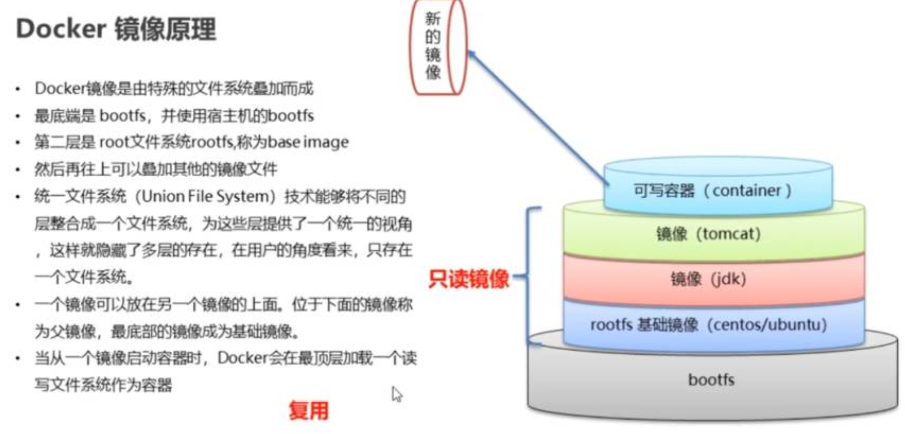

# Docker原理

操作系统组成：

- 进程调度子系统
- 进程通信子系统
- 内存管理子系统
- 设备管理子系统
- 文件管理子系统
- 网络通信子系统
- 作业控制子系统

Linux文件系统由bootfs和rootfs两部分组成：

- bootfs：包含bootloader（引导加载程序）和kernel（内核）；
- rootfs：root文件系统，包含的就是典型Linux系统中的/dev、/proc、/bin、/etc等标准目录和文件；
- rootfs基于bootfs构建；
- 不同的linux发行版，bootfs基本一致，而rootfs不同，如ubuntu、centos等。

docker原理：



- docker镜像本质：是一个分层文件系统；docker镜像是由特殊的文件系统叠加而成；
- 最底端是bootfs，并使用宿主机的bootfs；
- 第二层是root文件系统rootfs，称为base image；
- 然后再往上叠加其他的镜像文件；
- 统一文件系统（Union File System）技术能够将不同的层整合成一个文件系统，这些层提供了一个统一的视角，这样就隐藏了多层的存在，在用户看来，只存在一个文件系统；
- 一个镜像可以放在另一个镜像的上面，位于下面的镜像叫做父镜像，最底部的镜像成为基础镜像；
- 当从一个镜像系统启动容器时，docker会在最顶层加载一个文件系统作为容器；

镜像制作：

1. 容器转镜像：

   ```
   # 将容器转为镜像
   docker commit 容器id 镜像名称：版本号
   # 保存镜像为压缩文件
   docker save -o 压缩文件名称 镜像名称：版本号
   # 解压压缩文件为镜像
   docker load -i 压缩文件名称
   ```

2. dockerfile

   - 官方网站：[https://hub.docker.com](https://hub.docker.com)

   - dockerfile是一个文本文件；
   - 包含了一条条指令；
   - 每一条指令属于一层，基于基础镜像，最终构建出一个新的镜像；

dockerfile关键字：

- FROM
   指定基础镜像，当前新镜像是基于哪个镜像的。其中，`scratch`是个空镜像，这个镜像是虚拟的概念,并不实际存在,它表示一个空白的镜像，当前镜像没有依赖于其他镜像
   `FROM scratch`
- MAINTAINER
   镜像维护者的姓名和邮箱地址
   `MAINTAINER Sixah `
- RUN
   容器构建时需要运行的命令
   `RUN echo 'Hello, Docker!'`
- EXPOSE
   当前容器对外暴露出的端口
   `EXPOSE 8080`
- WORKDIR
   指定在创建容器后，终端默认登陆进来的工作目录，一个落脚点
   `WORKDIR /go/src/app`
- ENV
   用来在构建镜像过程中设置环境变量
   例如，ENV MY_PATH /usr/mytest
   这个环境变量可以在后续的任何RUN指令中使用，这就如同在命令前面指定了环境变量前缀一样;当然，也可以在其他指令中直接使用这些环境变量，比如：WORKDIR $MY_PATH
- ADD
   将宿主机目录下的文件拷贝进镜像且ADD命令会自动处理URL和解压tar压缩包
   `ADD Linux_amd64.tar.gz`
- COPY
   类似于ADD，拷贝文件和目录到镜像中，将从构建上下文目录中<源路径>的文件/目录复制到新的一层镜像内的<目标路径>位置
   `COPY . /go/src/app`
- VOLUME
   容器数据卷，用于数据保存和持久化工作
   `VOLUME /data`
- CMD
   指定一个容器启动时要运行的命令。Dockerfile中可以有多个CMD指令，但只有最后一个生效，CMD会被docker run之后的参数替换
   `CMD ["/bin/bash"]`
- ENTRYPOINT
   指定一个容器启动是要运行的命令。ENTRYPOINT的目的和CMD一样，都是在指定容器启动程序及参数
- ONBUILD
   当构建一个被继承的Dockerfile时运行的命令，父镜像在被子镜像继承后，父镜像的ONBUILD指令被触发