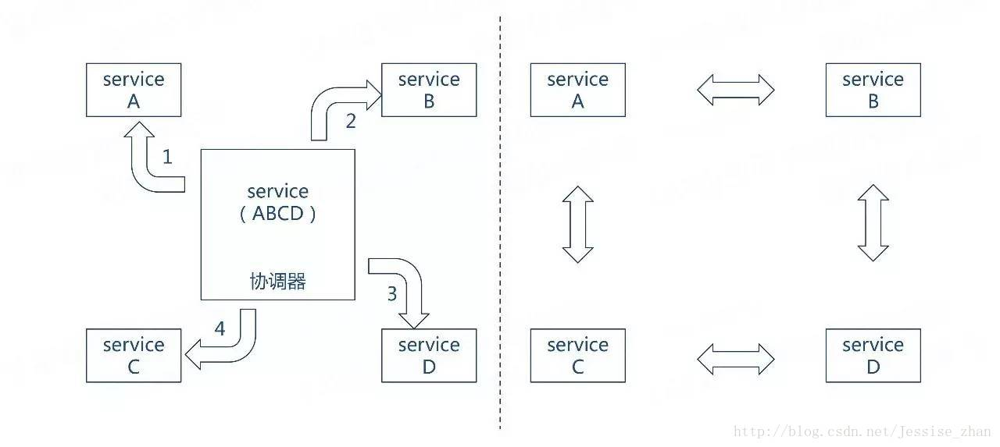

# 服务编排

### 概念

- 编制：Orchestration，强调的是通过一个可执行的中心流程来协同内部及外部的服务交互。通过中心流程来控制总体的目标，涉及的操作，服务调用顺序。

- 编排：Choreography，编排强调的是协作，通过消息的交互序列来控制各个部分资源的交互。参与交互的资源都是对等的，没有集中的控制。
- 

### 参考

- [微服务编排](https://blog.csdn.net/zhangjunli/article/details/88656584)
- [微服务核心研究之--编排](https://www.jianshu.com/p/54e2e223dbac)