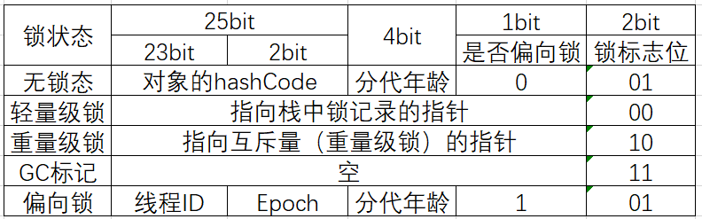

### CAS


Java中CAS的使用：

- AtomicInteger、AtomicLong、AtomicBoolean等；
- 带版本号的CAS：AtomicStampedReference

CAS底层实现（AtomicInteger）：

```java
// AtomicInteger的incrementAndGet方法
public final int incrementAndGet() {
    return unsafe.getAndAddInt(this, valueOffset, 1) + 1;
}
// Unsafe类的getAndAddInt方法
public final int getAndAddInt(Object var1, long var2, int var4) {
    int var5;
    do {
        var5 = this.getIntVolatile(var1, var2);
    } while(!this.compareAndSwapInt(var1, var2, var5, var5 + var4));

    return var5;
}
// 调用本地方法（JVM虚拟机）
public final native boolean compareAndSwapInt(Object var1, long var2, int var4, int var5);

// 最终在虚拟机中调用的是汇编代码，使用了汇编指令：
//  LOCK_IF_MP：MP（MulituProcessors）如果是多个CPU，则会加 lock 指令
//  lock指令：在执行当前代码块时，其他CPU不能打断
//  cmpxchg ：compare and exchange，用来修改cas变量值

// lock指令 ：在执行后面指令的时候锁定一个北桥信号（不采用锁总线的方式）

// volatile底层实现也是采用了lock指令
```

### 工具：JOL（Java Object Layout）

#### 对象在内存中的存储布局


查看JVM启动时默认的参数： `-XX:+PrintCommandLineFlags`

如：在命令行输入：`java -XX:+PrintCommandLineFlags -version `，输出：

```
-XX:InitialHeapSize=266093760 -XX:MaxHeapSize=4257500160 -XX:+PrintCommandLineFlags -XX:+UseCompressedClassPointers -XX:+UseCompressedOops -XX:-UseLargePagesIndividualAllocation -XX:+UseParallelGC
java version "1.8.0_251"
Java(TM) SE Runtime Environment (build 1.8.0_251-b08)
Java HotSpot(TM) 64-Bit Server VM (build 25.251-b08, mixed mode)
```

- -XX:InitialHeapSize：初始堆大小
- -XX:MaxHeapSize：最大堆大小
- -XX:+UseCompressedClassPointers：使用压缩指针，对应上述class Pointer，由8个字节压缩到4字节；
- -XX:+UseCompressedOops：Oop，Ordinary Object Pointer，普通对象指针，对于上述instance data，由8个字节压缩到4个字节。

JVM 64位，所以其指针长度为64位（8个字节），由于默认开启了`-XX:+UseCompressedClassPointers`，则会将命令指针由8个字节压缩成4个字节，即上述classPointer指针默认占用4个字节。

#### 使用工具查看对象内存布局

Java Object Layout：Jave 对象布局

引入JOL工具的依赖：

```xml
<dependency>
    <groupId>org.openjdk.jol</groupId>
    <artifactId>jol-core</artifactId>
    <version>0.9</version>
</dependency>
```

查看java.lang.Object类以及实例：

```java
// java.lang.Object以及实例
Object o = new Object();
System.out.println(ClassLayout.parseClass(Object.class).toPrintable());
System.out.println(ClassLayout.parseInstance(o).toPrintable());

// 输出：
java.lang.Object object internals:
 OFFSET  SIZE   TYPE DESCRIPTION                               VALUE
      0    12        (object header)                           N/A
     12     4        (loss due to the next object alignment)
Instance size: 16 bytes
Space losses: 0 bytes internal + 4 bytes external = 4 bytes total

java.lang.Object object internals:
 OFFSET  SIZE   TYPE DESCRIPTION                               VALUE
      0     4        (object header)                           01 00 00 00 (00000001 00000000 00000000 00000000) (1)
      4     4        (object header)                           00 00 00 00 (00000000 00000000 00000000 00000000) (0)
      8     4        (object header)                           e5 01 00 f8 (11100101 00000001 00000000 11111000) (-134217243)
     12     4        (loss due to the next object alignment)
Instance size: 16 bytes
Space losses: 0 bytes internal + 4 bytes external = 4 bytes total
```

查看自定义User类以及其实例：

```java
// User类定义
class User{
    private int id;
    private String name;
    ------------ setter/getter---------
}

// 测试
User user=new User();
System.out.println(ClassLayout.parseClass(User.class).toPrintable());
System.out.println(ClassLayout.parseInstance(user).toPrintable());
user.setId(10);
user.setName("Hello");
System.out.println(ClassLayout.parseInstance(user).toPrintable());

// 输出：
org.example.thread.User object internals:
 OFFSET  SIZE               TYPE DESCRIPTION                               VALUE
      0    12                    (object header)                           N/A
     12     4                int User.id                                   N/A
     16     4   java.lang.String User.name                                 N/A
     20     4                    (loss due to the next object alignment)
Instance size: 24 bytes
Space losses: 0 bytes internal + 4 bytes external = 4 bytes total

org.example.thread.User object internals:
 OFFSET  SIZE               TYPE DESCRIPTION                               VALUE
      0     4                    (object header)                           01 00 00 00 (00000001 00000000 00000000 00000000) (1)
      4     4                    (object header)                           00 00 00 00 (00000000 00000000 00000000 00000000) (0)
      8     4                    (object header)                           43 c1 00 f8 (01000011 11000001 00000000 11111000) (-134168253)
     12     4                int User.id                                   0
     16     4   java.lang.String User.name                                 null
     20     4                    (loss due to the next object alignment)
Instance size: 24 bytes
Space losses: 0 bytes internal + 4 bytes external = 4 bytes total

org.example.thread.User object internals:
 OFFSET  SIZE               TYPE DESCRIPTION                               VALUE
      0     4                    (object header)                           01 00 00 00 (00000001 00000000 00000000 00000000) (1)
      4     4                    (object header)                           00 00 00 00 (00000000 00000000 00000000 00000000) (0)
      8     4                    (object header)                           43 c1 00 f8 (01000011 11000001 00000000 11111000) (-134168253)
     12     4                int User.id                                   10
     16     4   java.lang.String User.name                                 (object)
     20     4                    (loss due to the next object alignment)
Instance size: 24 bytes
Space losses: 0 bytes internal + 4 bytes external = 4 bytes total
```

#### 面试题：Object  o=new Object()在内存中占用多少字节？

- 如果开启了"-XX:+UseCompressedClassPointers"，对象头（markword）占用 8 个字节，然后class Pointer占用 4 个字节，4+8 为 12 ，进行补齐加4，为16字节；
- 没有开启"-XX:+UseCompressedClassPointers"，对象头（markword）占用8个字节，然后class Pointer占用8个字节，共16个字节，无需补齐；

- Object类占用 16 个字节，Class 头占用 12 个字节，补齐 使用 4个，因此Object类占用 16 个字节。

### Synchronized

查看Object实例与对其加锁后对象内存布局信息：

```java
// Synchronized 的原理
Object o = new Object();
System.out.println(ClassLayout.parseInstance(o).toPrintable());
synchronized (o){
    System.out.println(ClassLayout.parseInstance(o).toPrintable());
}

// 输出
java.lang.Object object internals:
 OFFSET  SIZE   TYPE DESCRIPTION                               VALUE
      0     4        (object header)                           01 00 00 00 (00000001 00000000 00000000 00000000) (1)
      4     4        (object header)                           00 00 00 00 (00000000 00000000 00000000 00000000) (0)
      8     4        (object header)                           e5 01 00 f8 (11100101 00000001 00000000 11111000) (-134217243)
     12     4        (loss due to the next object alignment)
Instance size: 16 bytes
Space losses: 0 bytes internal + 4 bytes external = 4 bytes total

java.lang.Object object internals:
 OFFSET  SIZE   TYPE DESCRIPTION                               VALUE
      0     4        (object header)                           f0 f6 38 03 (11110000 11110110 00111000 00000011) (54064880)
      4     4        (object header)                           00 00 00 00 (00000000 00000000 00000000 00000000) (0)
      8     4        (object header)                           e5 01 00 f8 (11100101 00000001 00000000 11111000) (-134217243)
     12     4        (loss due to the next object alignment)
Instance size: 16 bytes
Space losses: 0 bytes internal + 4 bytes external = 4 bytes total
```

对照上述输出，可以看到synchronized加锁的信息存储在markword对象头中

#### JDK8 markword实现表



Hotspot的实现：


#### 锁升级过程

**锁升级过程**：new - 偏向锁 - 轻量级锁（无锁、自旋锁、自适应自旋） - 重量级锁

synchronized的优化过程与markword息息相关。

用markword最低的三位表示锁状态，其中1位是偏向锁位，两位是普通锁位

1. Object o = new Object()

   锁 = 0 01 无锁态

2. o.hashCode()

   001+hasCode

   ```
   // 未调用hashCode()时markword：(各部分位置不是固定的)
   01 00 00 00 (00000001 00000000 00000000 00000000) (1)
   00 00 00 00 (00000000 00000000 00000000 00000000) (0)
   // 调用hashCode()
   01 82 44 a1 (00000001 10000010 01000100 10100001) (-1589345791)
   74 00 00 00 (01110100 00000000 00000000 00000000) (116)
   ```

3. 默认synchronized(o)

   00 -> 轻量级锁

   默认情况：偏向锁有个时延，默认是4秒，原因：因为JVM虚拟机自己有一些默认启动的线程，里面存在很多sync代码，这些sync（同步）代码启动时就知道存在竞争，如果使用偏向锁，会不断进行锁撤销和锁升级的操作，效率较低。

   `-XX:BiasedLockingStartupDelay = 0`

4. 如果设定上述参数：

   new Object() - > 101偏向锁  - > 线程ID为0 - > Anonymous BiasedLock 

   打开偏向锁，new出来的对象，默认就是一个可偏向匿名对象 101

5. 如果有线程上锁：

   上偏向锁，指的就是，把markword的线程ID改为自己线程ID的过程

   偏向锁不可重偏向、批量偏向、批量撤销

6. 如果有线程竞争

   撤销偏向锁，升级轻量级锁

   线程在自己的线程栈生成LockRecord，用CAS操作就markword设置为指向自己这个线程的LR的指针，设置成功得到锁

7. 如果竞争加剧

   竞争加剧：有线程超过10次自旋（设置：-XX：PreBlockSpin）或者自旋线程数超过CPU核数的一般，jdk1.6之后，加入自适应自旋Adapative Self Spinning，JVM自己控制

   升级重量锁： - > 向操作系统申请资源，Linux mutex，CPU从3级 - 0级系统调用，线程挂起，进入等待队列，等待操作系统的调度，然后再映射回用户空间。

   （以上为JDK11，打开就是偏向锁，而JDK默认对象头是无锁）

   偏向锁默认是打开的，但有一个时延，如果要观察到偏向锁，应该设置参数

#### 锁消除lock eliminate

```java
public class LockEliminate {
    public void add(String str1,String str2){
        /**
         * StringBuffer 是线程安全的，因为其关键方法都是被synchronized修饰过的，
         * 但是在这段代码中，sb这个引用只会在add方法中使用，不可能被其他线程引用（局部变量，栈私有）
         * 因此，sb是不可能共享的资源，JVM会2自动消除StringBuffer对象内部的锁。
         */
        StringBuffer sb=new StringBuffer();
        sb.append(str1).append(str2);
    }
}
```

#### 锁粗化lock coarsening

```java
public class LockCoarsening {
    public String test(String str){
        int i =0 ;
        StringBuffer sb = new StringBuffer();
        /**
         * JVM 会检测到这样一连串的操作都对同一个对象加锁，while循环内100次append，没有锁粗化
         * 就要进行100次加锁/解锁，此时JVM就会将加锁的范围粗化到这一连串的操作的外部（比如while虚幻体外），
         * 使得这一连串加索只需要加锁一次即可。 
         */
        while (i<100){
            sb.append(str);
            i++;
        }
        return sb.toString();
    }
}
```

### synchronized实现过程

1. java代码：synchronized
2. MONITORENTER   MONITOREXIT
3. 执行过程中自动升级
4. lock cmpxchg

### volatile

两大作用：

- 保证线程间可见性：

  ```java
  public class DemoVolatile {
      /** volatile */ boolean running = true;
      void m(){
          System.out.println("m start");
          while (running){
  
          }
          System.out.println("m end");
      }
      public static void main(String[] args) {
          DemoVolatile demo=new DemoVolatile();
          new Thread(demo::m , "t1").start();
          try {
              TimeUnit.SECONDS.sleep(1);
          } catch (InterruptedException e) {
              e.printStackTrace();
          }
  
          demo.running = false;
      }
  }
  ```

- 内存屏障

#### 系统底层

- 实现数据一致性：
  - MESI：缓存一致性协议
  - 锁总线
- 实现有序性
  - sfence 、mfence、lfence等内存屏障
  - 锁总线
- volatile如何解决指令重排
  - volatile
  - ACC_VOLATILE
  - JVM的内存屏障：屏障两边的指令不可以重排！保障有序性