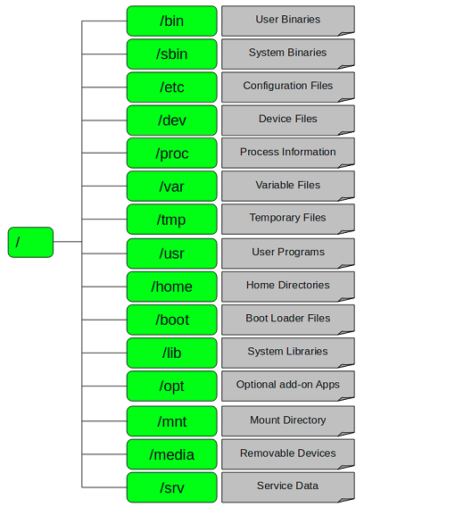

# Linux文件管理

### 文件类型

**LINUX**有四种基本文件系统类型：普通文件、目录文件、连接文件和特殊文件，可用**file**命令来识别。

- 普通文件：如文本文件、**C语言**源代码、**Shell**脚本、二进制的可执行文件等，可用**cat、less、more、vi、emacs**来察看内容，用**mv来**改名。

- 目录文件：包括文件名、子目录名及其指针。它是**LINUX**储存文件名的唯一地方，可用ls列出目录文件。

- 连接文件：是指向同一索引节点的那些目录条目。用ls来查看是，连接文件的标志用l开头，而文件面后以"->"指向所连接的文件。

- 特殊文件：**LINUX**的一些设备如磁盘、终端、打印机等都在文件系统中表示出来，则一类文件就是特殊文件，常放在 **/dev** 目录内。例如，软驱A称为/dev/fd0。**LINUX**无C：的概念，而是用 **/dev/had** 来自第一硬盘。

### 目录结构

比较：

- Windows文件结构：以多根的方式组织文件
- Linux文件结构：以单根的方式组织文件

Linux目录结构：FSH(Filesystem Hierachy Standard)

```
[root@www /]# ls
bin  boot  dev  etc  home  lib  lib64  media  mnt  opt  proc  root  run  sbin  srv  sys  tmp  usr  var
```



注意事项：在CentOS 7 中，如下几个 [ / ] 目录下的文件已经合并到其他文件夹去了，只剩下链接保留

-  /bin ： /usr/bin
- /sbin ：/usr/sbin

而 /usr/tmp 则合并到 /var/tmp 文件夹了。

#### [ **/ ]** - 根目录

每一个文件和目录从根目录开始。只有 **root** 用户具有该目录下的写权限。

- 请注意，**/root** 是 **root** 用户的主目录，这与 **/**.不一样。对你的电脑来说，有且只有一个根目录。

- 所有的东西都是从这里开始。举个例子：当你在终端里输入 “ **/home** ” ，你其实是在告诉电脑，先从/(根目录)开始，再进入到 home 目录。

- **/root** 这是系统管理员(**root user**)的目录。对于系统来说，系统管理员就好比是上帝，它能对系统做任何事情，甚至包括删除你的文件。因此，请小心使用 **root** 帐号。

#### [ **/**bin ] - 常见命令

包含二进制可执行文件，在单用户模式下，你需要使用的常见 **Linux** 命令都位于此目录下。

- 这里存放了标准的（或者说是缺省的）**linux** 的工具，比如像 “ **ls** ”、“ **vi** ” 还有 “ **more** ” 等等。通常来说，这个目录已经包含在你的 “ path ” 系统变量里面了。

- 什么意思呢?就是：当你在终端里输入 **ls**，系统就会去 **/bin** 目录下面查找是不是有 **ls** 这个程序。

- 系统的所有用户使用的命令都设在这里，例如：**ps、ls、ping、grep、cp、mv、rm。**

#### [ /sbin ] - 系统管理命令目录 系统二进制文件

就像 **/bin**，**/sbin** 同样也包含二进制可执行文件。但是，在这个目录下的 **linux** 命令通常由**系统管理员**使用，对系统进行维护。

- 例如：**iptables、reboot、fdisk、ifconfig、swapon**

- **/sbin** 大多是涉及系统管理的命令的存放，是超级权限用户 **root** 的可执行命令存放地，普通用户无权限执行这个目录下的命令。

- 这个目录和 **/usr/sbin**、 **/usr/X11R6/sbin** 或 **/usr/local/sbin** 目录是相似的；我们记住就行了，凡是目录 **sbin** 中包含的都是**root权限**才能执行的。

#### [ /etc ] - 配置文件

包含所有程序所需的配置文件，也包含了用于启动/停止单个程序的启动和关闭 **shell** 脚本。例如：**/etc/resolv.conf、/etc/logrotate.conf**。

- 这里主要存放了**系统配置**方面的文件。

#### [ /dev ] - 设备文件

这里主要存放与设备(包括外设)有关的文件( **unix** 和 **linux** 系统均把设备当成文件)。

- 磁盘：/dev/sda
- 终端：/dev/tty

```
# 查看磁盘
[root@www /]# ll /dev/sd*
brw-rw----. 1 root disk 8, 0 May  8 11:26 /dev/sda
brw-rw----. 1 root disk 8, 1 May  8 11:26 /dev/sda1
brw-rw----. 1 root disk 8, 2 May  8 11:26 /dev/sda2

[root@iZwz9de6ypp03mqjv3cshhZ ~]# ll /dev/zero /dev/null /dev/random 
crw-rw-rw- 1 root root 1, 3 Jan  4 11:44 /dev/null  # 空设备，类似回收站
crw-rw-rw- 1 root root 1, 8 Jan  4 11:44 /dev/random  # 产生随机数
crw-rw-rw- 1 root root 1, 5 Jan  4 11:44 /dev/zero  # 零设备
```

#### [ **/proc** ] - 进程信息

包含**系统进程**的相关信息。这是一个**虚拟**的文件系统，包含有关正在运行的进程的信息。例如：**/proc/{pid}** 目录中包含的与特定 **pid** 相关的信息。

系统资源以文本信息形式存在。例如：**/proc/uptime**

- **/proc** 操作系统运行时，存放进程信息及内核信息，例如 **cpu**、硬盘分区、内存信息等。

- **/proc** 目录伪装的文件系统 **proc** 的挂载目录，**proc** 并不是真正的文件系统，它的定义可以参见 **/etc/fstab** 。

#### [ **/var** ] - 变量文件

**var** 代表变量文件，这个目录的内容是经常变动的。看名字就知道，我们可以理解为 **vary** 的缩写；

**/var** 下有:

- **/var/log** 系统日志文件；
- **/var/lib** 包和数据库文件，用来存放一些库文件，比如**MySQL**的，以及**MySQL**数据库的的存放地；
- **/var/mail** 电子邮件；
- **/var/spool** 打印队列；
- **/var/lock** 锁文件；
- **/var/tmp** 多次重新启动需要的临时文件；
- **/var/www** 目录是定义**Apache**服务器站点存放目录；

#### [ /tmp ] - 临时文件

包含系统和用户创建的临时文件。

当系统重新启动时，这个目录下的文件都将被删除。

对于某些程序来说，有些文件被用了一次两次之后，就不会再被用到，像这样的文件就放在这里。

有些 **linux** 系统会定期自动对这个目录进行清理，因此，千万不要把重要的数据放在这里。

#### [ **/usr** ] - 用户程序

包含二进制文件、库文件、文档和二级程序的源代码。

- **/usr/bin** 中包含不适合放在 **/bin** 或 **/etc** 目录下的额外的工具。如果你在 **/bin** 中找不到用户二进制文件，到 **/usr/bin** 目录看看。例如：**at、awk、cc、less、scp**。

- **/usr/sbin** 中包含系统管理员的二进制文件。如果你在 **/sbin** 中找不到系统二进制文件，到 **/usr/sbin** 目录看看。例如：**atd、cron、sshd、useradd、userdel**。

- **/usr/lib** 中包含了 **/usr/bin** 和 **/usr/sbin** 用到的库。用于存放那些不能直接 运行的，但却是许多程序运行所必需的一些函数库文件。
- **/usr/local** 中包含了从源安装的用户程序。例如，当你从源安装**Apache**，它会在**/usr/local/apache2**中。
- **/usr/share** 用于存放一些共享的数据，比如音乐文件或者图标等等。

#### [ **/home** ] - HOME目录

这里主要存放你的个人数据。具体每个用户的设置文件，用户的桌面文件夹，还有用户的数据都放在这里。

- 每个用户都有自己的用户目录，位置为：/home/用户名。当然，**root** 用户除外。例如：**/home/john、/home/nikita。**

#### [ **/boot** ] - 引导加载程序文件

包含引导加载程序相关的文件。

**Linu x**的内核及引导系统程序所需要的文件目录，例如内核的 **initrd、vmlinux、grub** 文件位于 **/boot** 下。

例如：initrd.img-2.6.32-24-generic、vmlinuz-2.6.32-24-generic

在一般情况下，**GRUB** 或 **LILO** 系统引导管理器也位于这个目录。

#### [ **/lib** ] - 系统库

包含支持位于 **/bin** 和 **/sbin** 下的二进制文件的**库文件**；

**Linux**的库一般在 **/lib** 或者 **/use/lib** 目录下，**lib** 是库(**library**)的英文缩写，它主要存放系统的链接库文件，没有该目录则系统就无法正常运行。

**/lib**目录中存储着程序运行时使用的共享库。通过共享库，许多程序可以重复使用相同的代码，并且这些库可以存储在一个公共的位置上，因此能减小运行程序的大小。

这个目录包含程序在链接时使用的各种库；例如：**gcc、binfmt.d、yum-plugins**等；

#### [ **/opt** ] - 可选的附加应用程序

**opt** 代表可选的。包含从个别厂商的附加应用程序。附加应用程序应该安装在 **/opt** 或者 **/opt/** 的子目录下。

可以存放哪些可选的程序呢？

例如 安装 **firefox** 测试版，那就装到 **/opt** 目录下吧。这样，当你尝试完，想删掉 **firefox** 的时候，你就可以直接删除它，而不影响系统其他任何设置。

安装到 **/opt** 目录下的程序，它所有的数据、库文件等等都是放在同个目录下面。

举个栗子：刚才装的测试版 **firefox**，就可以装到 **/opt/firefox_beta** 目录下，**/opt/firefox_beta**目录下面就包含了运行 **firefox** 所需要的所有文件、库、数据等等。

要删除 **firefox** 的时候，你只需删除 **/opt/firefox_beta** 目录即可，非常简单。

#### [ **/mnt** ] - 挂载目录

临时安装目录，系统管理员可以挂载文件系统。

这个目录一般是用于存放挂载储存设备的挂载目录的，比如有 **cdrom** 等目录。可以参看 **/etc/fstab** 的定义。

有时我们可以把让系统开机自动挂载文件系统，把挂载点放在这里也是可以的。

主要看 **/etc/fstab** 中怎么定义了；比如光驱可以挂载到 **/mnt/cdrom** 。

#### [ **/media** ] - 可移动媒体设备

**linux** 的发行版使用这个目录来挂载那些usb接口的移动硬盘(包括U盘)、CD/DVD驱动器，挂载可移动设备的临时目录。

例如，挂载 **CD-ROM** 的 **/media/cdrom**，挂载软盘驱动器的 **/media/floppy** 等等；

#### [ **/srv** ] - 服务数据

**srv** 代表服务，主要用来存储本机或本服务器提供的**服务**或**数据**。（**用户主动生产的数据、对外提供服务**）

包含服务器特定服务相关的数据。例如，**/srv/cvs** 包含 **cvs** 相关的数据。

### 文件路径

分两种表达方式：

- 绝对路径：从根目录下进行计算
  - /：根目录
  - ~/ ：当前用户的home文件夹
  - ~xiaowang/ ：xiaowang用户的home文件夹
- 相对路径：相对于当前目录开始
  - `.`：当前路径
  - `..`：当前路径的上一级文件夹

- 查看当前目录路径：pwd

### 文件操作

1. 文件创建：

   创建文件：

   - touch file.txt：无则创建文件，有则修改时间

   创建多个文件：

   - touch file1 file2：创建多个文件
   - touch file{1..20} ：创建file1到file20共20个文件
   - touch file{a..f}：创建filea 到 filef 共6个文件
   - touch file{a,b,c}：创建filea、fileb、filec三个文件  // {}表示集合
   - touch {1..10}{1..1000}：创建10*1000个文件
   - touch {1..100}.txt ：创建100个txt文件

   避免创建新文件：

   - touch -c file：如果文件存在，touch将更新访问时间，否则将不执行任何操作

   更改文件访问时间：

   - touch -a file：仅更改file的访问时间
   - stat file：检查访问时间

   更改文件修改时间：

   - touch -m file：仅更改file的修改时间
   - 支持通配符

2. 目录创建

   创建单个目录：

   - mkdir dir1：创建单个目录

   创建多个目录：

   - mkdir dir1 dir2

   显示创建过程：

   - mkdir -v dir{1..3}

3. 复制：cp

   ```
   [root@www home]# type -a cp
   cp is aliased to `cp -i'
   cp is /usr/bin/cp
   [root@www home]# whatis cp
   cp (1)               - copy files and directories
   cp (1p)              - copy files
   
   # 多文件加下文件的复制
   # 最麻烦的方式
   cp /etc/sysconfig/network-scripts/ifcfg-ens32 /etc/sysconfig/network-scripts/ifcfg-ens32-em1.bak 
   # 稍微好一点的方式
   cp /etc/sysconfig/network-scripts/{ifcfg-ens32,ifcfg-ens32-em1.bak }
   # 再简化一点
   cp /etc/sysconfig/network-scripts/ifcfg-ens32{,.bak} -v
   ```
   
4. 移动：mv

   - mv flie1 /usr/dir1 ：将file1移动到/usr/dir1目录
   - mv file1 /usr/dir1/file2：移动过程中改名
   - mv file1 file2：在同一目录下移动可以实现改名

5. 删除：rm

   - -r：递归
   - -f：强制
   - -v：详细过程
   - `rm -rf *`：*不包含隐藏文件

   手动删除，进入要删除目录删除；sh脚本，使用绝对路径；

6. 查看文本文件内容：

   - cat

     - -n：显示行号

     - -A：包括控制字符（换行符/制表符）

     - windows换行符：^M$

       Linux：$

       需要进行转换：

       - 安装：yum -y install dos2unix
       - 使用：dos2unix filename

   - less：分页展示

   - head：默认查看文件前10行

     - head -n filename：查看filename前n行

   - tail：默认查看文件后10行

     - tail -n filename：查看filename后n行
     - tail -f/F file：动态监控文件尾部

   - tailf：动态监控文件尾部的变化，知道ctrl + C暂停

7. grep：针对文件内容进行过滤

   - grep [正则表达式] file：过滤出正则表达式所表达的内容