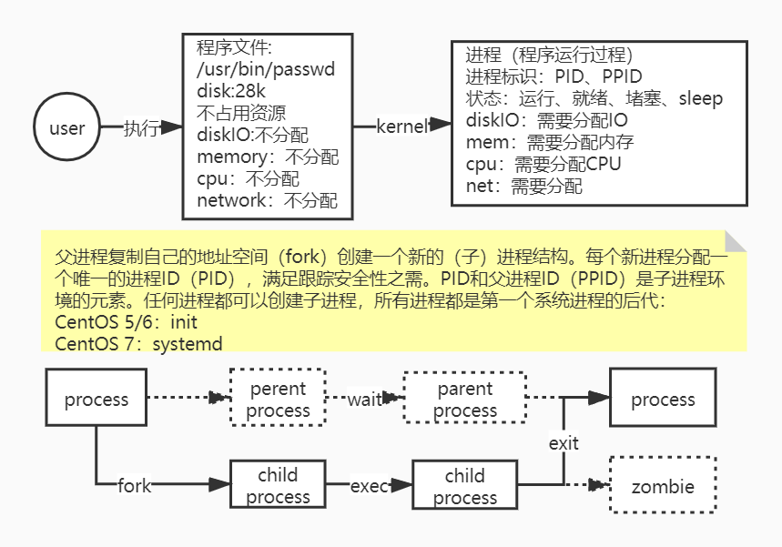

# 进程

- 通过lscpu查看cpu信息

进程：进程是已启动的可执行程序的运行实例，进程有如下组成部分：

- 已分配内存的地址空间；
- 安全属性，包括所有权凭据和特权；
- 程序代码的 一个或多个执行线程；
- 进程状态

程序：二进制文件，静态 /bin/date，/bin/sbin/httpd等

进程：是程序执行的过程，动态，存在生命周期及运行状态



### 进程命令

- 静态查看进程：ps

  ps命令分三种命令模式

  - Unix：需要带"-"
  - BSD：不能带"-"
  - GNU：带"--"

  参数：

  - ps aux | less：分页查看进程

    结果：

    - USER：用户

    - PID：进程ID

    - %CPU：CPU占用率

    - %MEM：内存占用率

    - VSZ：占用虚拟内存

    - RSS：占用实际内存/驻留内存

    - TTY：进程运行的终端

    - STAT：进程状态（man ps  --> /STATE）

      - R：运行

      - S：可中断睡眠

      - D：不可中断睡眠

      - T：停止的进程

      - Z：僵尸进程

      - X：死掉的进程

        

      - Ss：s进程的领导者，父进程

      - S<：<优先级较高的进程

      - SN：N优先级较低的进程

      - R+：+表示是前台的进程组

      - Sl：l 以多线程的方式运行

    - START：进程的启动时间

    - TIME：进程占用CPU的总时间

    - COMMAND：进程文件，进程名

  - ps aux --sort -%mem | less：降序输出

  - ps auxf | grep httpd：查看线程之间的父子关系

  - ps -ef：会输出PPID

    ```
    UID         PID   PPID  C STIME TTY          TIME CMD
    root          1      0  0 11:48 ?        00:00:05 /usr/lib/systemd/systemd --switched-root --system --deserialize 22
    root          2      0  0 11:48 ?        00:00:00 [kthreadd]
    ```

  - ps axo pid,ppid,user,%cpu,command --sort %cpu：显示指定的信息

  - 查看指定进程的PID：ps aux | grep 进程名

  - 查看进程数：pstree

- 动态查看进程：top

  - -d：延迟时间，每次捕捉延时
  - -p：指定追踪进程的动态信息
  - -u：查看指定用户的进程
  - -n：查看几次

  查看信息结果：

  - up：持续运行时间
  - user：用户数
  - load average：1、5、15分钟的平均负载，用负载/CPU数 >1，说明过载

  命令：

  - enter：立即刷新
  - 1：显示所有CPU的情况
  - z：显示成彩色
  - shift + p：按CPU使用进行排序
  - shift + m：按mem使用进行排序
  - shift + n：以PID的大小进行排序
  - shift + r：对排序字段进行反转
  - `>`：向前
  - `<`：向后
  - **f：自定义显示字段**
  - shift + w：保存top环境设置（/root/.toprc，即当前用户home文件夹下 .toprc）

  

