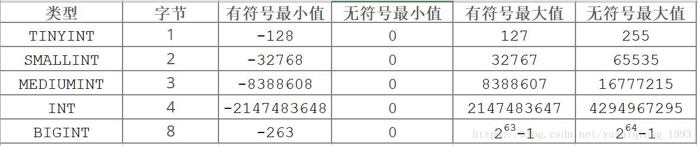

# MySQL基础知识

### 数据完整性

- 数据库操作：

  - 创建：`create database database_name;`
  - 查看：`show databases;`
  - 使用数据库：`use database_name;`

- 数据类型约定：

  - M：表示整数类型的最大显示宽度，允许的**最大值 M 取决于数据类型**，不设置时默认的显示宽度则是该字段类型最大的显示宽度。如int(5)表示显示5位，存储大小由 int 类型决定。
    - M表示整数类型的最大显示宽度。
    - 对于浮点和定点类型， M是可以存储的总位数（精度）。
    - 对于字符串类型， M是最大长度。
  - D：适用于浮点和定点类型，并指示小数点后面的位数。最大可能值为30，但不应大于 M-2。
  - [ ]：表示类型定义的可选部分。

- 数据类型：

  - 数值
  - 日期/时间
  - 字符串类型

- 整数型：

  - TINYINT [(M)] [UNSIGNED] [ZEROFILL] ：范围非常小的整数，有符号的范围是 -128到127，无符号的范围是0到 255

  - SMALLINT [(M)] [UNSIGNED] [ZEROFILL] ：范围较小的整数，有符号的范围是 -32768到32767，无符号的范围是0到 65535

  - MEDIUMINT [(M)] [UNSIGNED] [ZEROFILL]： 中等大小的整数，有符号的范围是 -8388608到8388607，无符号的范围是0到 16777215。

  - INT [(M)] [UNSIGNED] [ZEROFILL] ：正常大小的整数，有符号的范围是 -2147483648到 2147483647。无符号的范围是 0到4294967295。

  - BIGINT [(M)] [UNSIGNED] [ZEROFILL] ：大整数，有符号的范围是 -9223372036854775808到 9223372036854775807，无符号的范围是0到 18446744073709551615。

    

- 浮点型：浮点数存在精度丢失的问题，如果涉及到小数运算，尽量不要用浮点型

  - FLOAT [(M,D)] [UNSIGNED] [ZEROFILL]
    一个小的（单精度）浮点数。允许值是-3.402823466E+38 到-1.175494351E-38， 0以及1.175494351E-38 到3.402823466E+38,M是总位数，D是小数点后面的位数。
  - DOUBLE [(M,D)] [UNSIGNED] [ZEROFILL]
    正常大小（双精度）浮点数。允许值是 -1.7976931348623157E+308到-2.2250738585072014E-308，0以及 2.2250738585072014E-308到 1.7976931348623157E+308。M是总位数，D是小数点后面的位数

- 定点型：**DECIMAL也在存储时存在精度丢失的问题**

  - DECIMAL [(M[,D])]  [UNSIGNED]  [ZEROFILL]
    常用于存储精确的小数，M是总位数，D是小数点后的位数。小数点和（负数） -符号不计入 M。如果 D为0，则值没有小数点或小数部分。最大位数（M）为 65. 最大支持小数（D）为30.如果D省略，则默认值为0.如果M省略，则默认值为10。M的范围是1到65。D范围为0到30，且不得大于M。

- 字符串类型：

  - CHAR[(M)] ：一个固定长度的字符串，在存储时始终用空格填充指定长度。 M表示以字符为单位的列长度。M的范围为0到255.如果M省略，则长度为1，存储时占用M个字节
  - VARCHAR(M)：可变长度的字符串，M 表示字符的最大列长度，M的范围是0到65,535，存储时占用L+1（L<=M,L为实际字符的长度）个字节
  - TINYTEXT[(M)] ：不能有默认值，占用L+1个字节，L<2^8
  - TEXT[(M)] ：不能有默认值，占用L+2个字节，L<2^16
  - MEDIUMTEXT[(M)] ：不能有默认值，占用L+3个字节，L<2^24
  - LONGTEXT[(M)]： 不能有默认值，占用L+4个字节，L<2^32
  - ENUM('value1','value2',...)： ENUM是一个字符串对象，其值从允许值列表中选择，它只能有一个值，从值列表中选择,最多可包含65,535个不同的元素
  - SET('value1','value2',...) ：字符串对象，该对象可以有零个或多个值，最多可包含64个不同的成员

- 时间日期：

  - TIME： 范围是’-838:59:59.000000’ 到’838:59:59.000000’ ，格式：`D hh:mm:ss`
  - DATE 支持的范围是 ‘1000-01-01’到 ‘9999-12-31’
  - DATETIME 日期和时间组合。支持的范围是 ‘1000-01-01 00:00:00.000000’到 ‘9999-12-31 23:59:59.999999’。
  - TIMESTAMP 时间戳。范围是’1970-01-01 00:00:01.000000’UTC到’2038-01-19 03:14:07.999999’UTC。
  - YEAR 范围是 1901到2155

- 数据表table操作：

  - 创建数据表：`create table table_name()`
  - 查看数据表：`show tables;`
  - 查看数据表信息：`desc table_name;`
  - 查看数据表的sql：`show create table table_name;`

- 实体完整性：

  - 实体完整性是对关系记录中的记录唯一性
  - 定义表中所有行能唯一的标识
  - 表中主属性（字段）不能为NULL且不能有相同值
  - 一般用主键、唯一索引、unique关键字来实现

- 约束条件：

  - UNSIGNED ：无符号，值从0开始，无负数
  - ZEROFILL：零填充，当数据的显示长度不够的时候可以使用前补0的效果填充至指定长度,字段会自动添加UNSIGNED
  - NOT NULL：非空约束，表示该字段的值不能为空
  - DEFAULT：表示如果插入数据时没有给该字段赋值，那么就使用默认值
  - PRIMARY KEY：主键约束，表示唯一标识，不能为空，且一个表只能有一个主键。一般都是用来约束id
  - AUTO_INCREMENT：自增长，只能用于数值列，而且配合索引使用,默认起始值从1开始，每次增长1
  - UNIQUE KEY：唯一值，表示该字段下的值不能重复，null除外。比如身份证号是一人一号的，一般都会用这个进行约束
  - FOREIGN KEY：外键约束，目的是为了保证数据的完成性和唯一性，以及实现一对一或一对多关系

- 主键约束：

  - 查看定义的主键：`show create table 表名;`

  - 查看表信息：`desc 表名;`

  - 主关键字，primary key，是表中的一个或多个字段，其值用于唯一地标识表中的某一条记录

    - 被标识的字段不允许重复
    - 且不能为null
    - 在一张表中只允许一个主键存在，即有且只有一个

  - 创建表时指定主键：

    ```sql
    # 方式一：
    create table t_user(
        user_id int(10) primary key auto_increment,
        user_name varchar(30) default ""
    )ENGINE=InnoDB AUTO_INCREMENT=5 DEFAULT CHARSET=utf8mb4 COLLATE=utf8mb4_0900_ai_ci
    
    # 方式二：
    create table t_user(
        user_id int(10) auto_increment,
        user_name varchar(30),
        primary key(user_id)
    )ENGINE=InnoDB AUTO_INCREMENT=5 DEFAULT CHARSET=utf8mb4 COLLATE=utf8mb4_0900_ai_ci
    
    # 方式三：复合主键，constraint:键约束的关键字
    # 格式：constraint 约束名 约束类型 约束的列
    create table t_user(
        user_id int(10) auto_increment,
        user_name varchar(30),
        constraint PK_ID_NAME primary key(user_id,user_name), 
    )ENGINE=InnoDB AUTO_INCREMENT=5 DEFAULT CHARSET=utf8mb4 COLLATE=utf8mb4_0900_ai_ci
    ```

  - 通过 alter 语句添加主键约束：

    ```sql
    # 方式一：
    alter table 表名 modify 列名 int(10) primary key;
    
    # 添加语句需要表中原本没有主键，一般用于创建表时未设置主键时用
    # 方式二：
    alter table 表名 add primary key(列名);
    # 方式三：
    alter table 表名 add constraint PK_ID primary key(列名);
    ```

  - 删除主键约束：`alter table 表名 drop primary key;`

- 唯一约束：

  - 特性：
    - 唯一约束是指定table的列或列组合不能重复，保证数据的唯一性
    - 唯一约束不允许出现重复的值，但可以多个为null
    - 同一个表中可以有多个唯一约束，多个列组合的约束
    - 如果不给唯一约束名称，默认和列名相同
    - MySQL会给唯一约束的列上一个默认创建的一个唯一索引
  - 建表时添加唯一约束：`constraint 约束名 unique (列名)`
  - 添加唯一约束：`alter table 表名 add constraint 约束名 unique (列名)`
  - 删除唯一约束：`alter table 表名 drop key 约束名`

- 域完整性：

  - 默认值约束，使用 default 关键字
    - 创建表时添加：`create table 表名 (id int(10) primary key, name varchar(25) default '');`
    - 表建好后添加：`alter table 表名 modify name varchar(25) default '';`
    - 删除默认约束：`alter table 表名 modify name varchar(25);`
  - 非空约束：限制某个字段不允许取空值 null
    - 非空约束可以存在重复的值
    - 一个表中允许多个非空约束
    - 创建表时添加：`create table 表名 (id int(10) primary key, name varchar(25) default '' not null);`
    - 通过 alter 语句：`alter table 表名 modify name varchar(25) not null;`
    - 删除非空约束：`alter table 表名 modify name varchar(25);`

- 参照完整性：指表与表之间的数据参照引用，使用外键约束实现，关键字 foreign key (column1[,...]) reference table_name(column1[,...]) 

  - 语法格式：`contraint 外键名 foreign key (当前表字段,...) references 其他表名(表字段,...);`
  - 外键约束必要条件：
    - 从表和主表之间必须存在参照关系，从表的参照字段和主表的被参照字段的数据类型必须一致或可以转换
    - 主表和从表必须按照 **innoDB** 存储引擎创建
    - 表的外键值必须在主表中存在，或者为null
    - 主表的被参照字段必须是**主表的主键**
    - 创建表时必须先创建主表，删除时必须先删除从表
  - 创建时添加外键：`constraint fk_name foreign key (column1[,...]) references other_table(column1[,...]); `
  - alter 添加外键：`alter table 表名 add constraint fk_name foreign key (当前表字段,...) references other_table(column1[,...]);`
  - 删除外键：`alter table 表名 drop fk_name`

### 增删改

- 插入数据：
  - 单条数据：`insert into table_name (column1[,...]) value (value1[,...]);`
  - 多条数据：`insert into table_name (column1[,...]) values (value1[,...]),(value1[,...]),...;`
  - 配合select语句（注意，**没有 values 连接**）：`insert into table_name (column1[,...]) select (column1[,...]) from xxx`
- 删除数据：
  - 清空表数据：
    - `delete from table_name;` ：删除数据时可以加上过滤条件，可以找回数据，效率低
    - `truncate table table_name;` ：整表删除，不能恢复，不能加条件，效率高
    - `drop table table_name;` ：删除表，会将表结构干掉
  - 删除满足条件的数据：`delete from table_name where 查询子句;` 
- 修改数据：
  - `update table_name set 字段=值[,字段=值] where 查询条件` ：更新数据
  - 修改数据库的账号和密码：
    - 直接修改mysql.user表
      - `update mysql.user set password=password('root') where User='root' and host='localhost'` 
      - 权限刷新：`flush privileges;`
    - `set password for 用户名@localhhost = password("新密码");`
    - 新版本：`alter user 用户名@localhost identified by '新密码';`
    - 未登录：`mysqladmin -u用户名 -p旧密码 password 新密码`
    - 忘记原密码（windows系统）：
      - 关闭Mysql服务
      - 打开dos窗口，转到 mysql\bin 目录
      - 输入`mysqld --skip-grant-tables` ，--skip-grant-tables：指启动mysql服务时跳过权限表认证
      - 再开一个dos，转到  mysql\bin 目录
      - 输入 mysql
      - 使用上述修改数据库表的方式修改数据

### 查询数据

select基本语法：

```sql
SELECT *|字段名|聚合函数|字段的算数运算
FROM 表名
WHERE 过滤条件，查询前
GROUP BY 分组字段，可以存在多个列，查询后
HAVING 分组条件，可以包含聚合函数
ORDER BY 排序字段 ASC(升序)|DESC(降序)
LIMIT 查询起始行号(从0计数),查询条数
(OFFSET 偏移量：与Limit连用，即Limit第一个参数的效果，偏移量);
```

where子句语法：

```sql
where子句可用的运算符：
1. 比较：< > = <= >= != !> !<
2. 逻辑运算：and 并且、 or 或者、not 取反 ，优先级 not>and>or
3. 范围搜索：
		between 下限 and 上限
	  not between 下限 and 上限
4. 列表搜索查询：
		字段 in (列1，...)
		字段 not in (列1，...)
5. 模糊查询：
		字段 like 包含匹配的字符串(%:多字符，_:匹配单字符)
6. null 空值查询：
		字段 is null
		字段 is not null
```

基本查询：

```sql
# 列表搜索条件：使用in关键字使用户可以选择与列表中的任意值匹配的行
  # 查询name为张三、李四的记录
  SELECT id,name,age,email FROM t_user WHERE name in ('张三','李四'); 
 
# 模糊查询：使用like关键字，语法：WHERE 字段 like 匹配表达式
# 通配符： %（一个或多个字符）
#          _（一个字符）
  # 查询5月16日的记录
  SELECT * FROM t_user WHERE gmt_create LIKE '%05-16%';
	# 查询姓炸的记录，且名字长度为 两位
	SELECT * FROM t_user WHERE `name` LIKE '炸_';
	
# 判null查询：WHERE 字段 IS NULL
# 非null查询：WHERE 字段 IS NOT NULL
  # 判断email为 null 的记录
	SELECT * FROM t_user WHERE email IS NULL;
	# 判断email不为 null 的记录
	SELECT * FROM t_user WHERE email IS NOT NULL;
	
# 聚合函数：函数名([DISTINCT] <列名>)
# sum：列求和  avg：列平均值 max：列最大值 min：列最小值 count：统计个数
# 注意事项：以上聚合函数除了count（null值不会被统计），其他函数在计算过程中均忽略null值
  # 求表中的记录数和email记录数
	SELECT COUNT(id),COUNT(email) FROM t_user;
	# 年龄平均值、最大、最小年龄
	SELECT AVG(age) '平均年龄',MAX(age) '最大年龄',MIN(age) '最小年龄' FROM t_user;

# 分页查询：limit [startIndex,]pageSize; 
# startIndex：可省略不写，起始行号
# pageSize：查询的行数
# MySQL数据库中，记录行号从0开始
  # 查询起始第n页的数据，每页有m条记录 limit (n-1)*m,m;
  SELECT id,name,age,email FROM t_user LIMIT 8,4;

# 分组查询：GROUP BY，用于结合聚合函数，根据一个或多个列对结果集进行分组
# 分组可以按多个字段进行分组，GROUP BY name,age;
# 注意事项：
#   GROUP BY：属于查询之后，对查询出的结果集的处理
#   WHERE：查询之前对查询条件的限定
  # 按name分组，查询每组的平均年龄
	SELECT name,COUNT(name),AVG(age) FROM t_user GROUP BY name;
	# 按同name和同age的记录进行分组
	SELECT name '姓名',age '年龄',count(name) FROM t_user GROUP BY name,age;
	
# 分组条件：HAVING关键字，通常与GROUP BY子句连用，对查询后的结果集进行处理
# 语法：HAVING 条件
# HAVING子句可以包含聚合函数，但where不可以
  # 查询同名的名字中平均年龄大于25岁的名字
	SELECT name,AVG(age) FROM t_user GROUP BY `name` HAVING AVG(age)>25;
	
# 排序：ORDER BY语句用于对指定的结果集进行排序，默认升序，降序可以使用 DESC
# 语法：ORDER BY 列名 DESC(降序)/ASC(升序)
  # 按生成时间降序显示所有数据
	SELECT * FROM t_user ORDER BY gmt_create DESC;
	# 按年级大小升序显示所有记录
	SELECT * FROM t_user ORDER BY age;

# 取别名：AS 关键字，列名/表名 as 别名，AS 可省略
# 注意事项：列别名不能用于where子句，表别名可以用于where子句
  SELECT * FROM t_user as t WHERE t.id = 14;
```

字符串函数：

```sql
# mysql常用的内置函数

# 字符串函数
# LENGTH(str)：返回字符串占用的字节个数
# CHAR_LENGTH(str)：返回字符串的字符长度
# MID(str,pos,len)：可以从某个位置获取某个长度的字符（不是字节）,pos从1开始计数
#     截取位置：[pos,pos+len)
#     pos：从1开始计数
# SUBSTR(str FROM pos FOR len):截取字符串，pos也是从1开始计数
  # 查询每个名字的字符数，utf8中文占3个字节
	SELECT name,LENGTH(name),CHAR_LENGTH(name),age,LENGTH(age),CHAR_LENGTH(age) FROM t_user;
	# 截取email前5位
	SELECT MID(email,1,5) FROM t_user;
	SELECT SUBSTR(email FROM 1 FOR 5) FROM t_user;

# 数学函数
# ROUND(X,D)：对X作D位的四舍五入处理
# LEAST(value1,value2,...)：求最小的值
# GREATEST(value1,value2,...)：求出最大的值
# FLOOR(X)：将X向下取整
# CEILING(X)/CEIL(X)：将X向上取整
	# 查询年龄的平均值，取2位小数
  SELECT ROUND(AVG(age),2) FROM t_user;
	# 查询小数3.14153保留2位小数
	SELECT ROUND(3.1415326,3);	
	# 查询小数3.14153向下取整
	SELECT FLOOR(3.1415326);
	# 查询小数3.14153向上取整
	SELECT CEILING(3.1415326);
	SELECT CEIL(3.1415326);
	
# 日期时间函数
# NOW()：查看数据库服务器当前日期时间
# CURRENT_DATE:可以求得数据库服务器当前日期
# CURRENT_TIME：当前时间
# CURRENT_USER：当前用户
# CURRENT_TIMESTAMP：当前时间戳
# TO_DAYS(date)：将日期转化为总天数
# DAYOFYEAR(date)/DAYOFMONTH(date)/DAYOFWEEK(date)：该年/月/周已过的天数
# WEEK(date[,mode])：返回当前的时日是第几周
# DATE_ADD(date,INTERVAL expr unit)：算出date加上一定时间后的时间，unit单位：year,MONTH,DAY,HOUR等
  SELECT NOW(),CURRENT_DATE,CURRENT_TIME,CURRENT_USER,CURRENT_TIMESTAMP;
	# 将传入的日期转化成总天数
	SELECT TO_DAYS('2020-01-01');
	# 根据传入的日期求得已经过了多少天
	SELECT DAYOFYEAR('2020-5-17'),DAYOFMonth('2020-5-17'),DAYOFWEEK('2020-5-17'),WEEK('2020-5-17');
	# 18年后/前的此时此刻的时间
	SELECT DATE_ADD(Now(),Interval 18 YEAR);
	SELECT DATE_ADD(Now(),Interval -18 YEAR);
	
# 控制函数：主要用于null空值时的处理
# IF 有三个参数，第一个参数为空输出第三个参数，否则输出第二个参数
# SELECT IF(布尔表达式/NULL,'世界','美好');
# IFNULL(expr1,expr2)：有两个参数，第一个参数为空输出第一个，否则输出第二个参数
  # 实验语句
	SELECT IF(true,'世界','美好');
	# 查询email，如果为空则做其他处理
	SELECT name,IF(email is not NULL,email,'example@qq.com') FROM t_user;
	SELECT name,IFNULL(email,'example@qq.com') FROM t_user;
```

多表查询：

```sql
# 关联查询：基于笛卡尔积
# 笛卡尔积处理两张表成一张表：列相加，行数相乘
# SQL语句：SELECT * FROM 表1,表2,...;
# 处理过程：第一张表的数据与第二张表的数据分别拼接
# 关联条件：WHERE 表1.字段 = 表2.字段;
# 筛选条件：WHERE 条件语句;
  # 单表查询
	SELECT * FROM t_student;
  SELECT * FROM t_class;
  # 笛卡尔积拼接
	SELECT * FROM t_student,t_class;
	SELECT * FROM t_student st,t_class cl WHERE st.class_id=cl.class_id;
	SELECT st.stu_id,st.name,st.sex,st.address,cl.class_name,cl.cource FROM t_student st,t_class cl WHERE st.class_id=cl.class_id;
	
#  表连接：在实际查询应用中，用户所需要的数据并不全在一个表中，可能存在多个表中，这就需要多表查询；
# 在数据库应用中，经常需要从多个相关的表中查询数据，这就需要进行表连接。
# 内部连接：等值连接|非等值连接，根据连接条件
#   语法形式1：SELECT select_list FROM 表1,表2 WHERE 表1.列=表2.列
#   语法形式2：SELECT select_list FROM 表1 [INNER] JOIN 表2 ON 表1.列=表2.列
# 外部连接：
#   左外部连接：对连接条件左边的表不加限制 left [outer] join
#   右外部连接：对连接条件右边的表不加限制 right [outer] join
# 全关联：mysql不支持全关联 full JOIN
# mysql使用 union 关键字，将多个查询拼接
  # 内部连接：方式1
	SELECT * FROM t_student s,t_class c where s.class_id=c.class_id;
	# 内部连接：方式2
	SELECT * FROM t_student s INNER JOIN t_class c ON c.class_id=s.class_id;
	SELECT s.stu_id,s.name,c.class_name FROM t_student s INNER JOIN t_class c ON c.class_id=s.class_id;
	SELECT * FROM t_student s INNER JOIN t_class c ON c.class_id=s.class_id;
	SELECT * FROM t_student a RIGHT JOIN t_class b on a.class_id=b.class_id;
	SELECT * FROM t_student a LEFT JOIN t_class b on a.class_id=b.class_id;
	
	SELECT * FROM t_student a RIGHT JOIN t_class b on a.class_id=b.class_id
	UNION 
	SELECT * FROM t_student a LEFT JOIN t_class b on a.class_id=b.class_id;
# 显示建表sql
show create table t_student

# 子查询语句：
# 嵌套子查询：在mysql中子查询可以嵌套使用，并且可以在一个查询中嵌套任意多个子查询。
# 单值子查询：只返回一个值
```

表结构的操作：

```sql
# 复制表结构
# CREATE TABLE new_table LIKE old_table; 复制表结构，不会复制数据
  CREATE TABLE t_user_bak LIKE t_user;
# 复制表时顺便拷贝数据：CREATE TABLE new_table AS SELECT * FROM old_table;
  CREATE TABLE t_user_bak1 as SELECT * FROM t_user;
# 复制表的部分数据：CREATE TABLE new_table AS SELECT 字段1，... FROM old_table;
  CREATE TABLE t_user_bak3 as SELECT id,name,age FROM t_user LIMIT 5 OFFSET 3;
# 查看表结构：DESC table_name;
  desc t_user_bak;
# 显示建表语句：SHOW CREATE TABLE table_name;
  show CREATE TABLE t_user_bak;
# 更改表名：RENAME TABLE old_name TO new_name;
# 查看所有表：SHOW TABLES;
```

insert/update与select配合实现查询插入：

```sql
# INSERT与SELECT配合实现查询插入：
# INSERT INTO table (字段1,..) SELECT 字段1,.. FROM table;
INSERT INTO t_student (name,sex,address,class_id) 
SELECT name,sex,address,class_id FROM t_student;

# UPDATE与SELECT配合实现更新操作：不能同表同时执行更新查询操作  
# UPDATE table_name SET xx=xx WHERE xx in SELECT xx FROM table_name WHERE 子句;
```

数据库的备份与还原：

```sql
# 数据库的备份与还原：数据库的迁移
# 对数据库进行热备份的一个工具：mysqldump.exe
# 在命令行：
#   mysqldump -h 主机地址 （ip或域名） -u 用户名 -p 密码 要备份的数据库名 > 本地电脑路径/数据文件名.sql
# 数据库的还原：mysql.exe
#   方法一：mysql -h ip/域名 -u 用户名 -p 密码 数据库名< 本地路径/数据文件名.sql
#   方法二：1.先登录到数据库命令行； 2.use 数据库； 3.source 本地路径/数据文件名.sql
```

视图操作：

```sql
# 视图：基于某个查询结果的虚表，方便用户对数据的操作
#   视图本身并不存储数据，只是保存了连接，修改表名会使视图失效；
#   对视图的修改会映射到实际的表中；
# 格式：CREATE VIEW 视图名(映射字段) AS SELECT 语句
# 视图修改：ALTER VIEW 视图名 AS SELECT 语句
# 删除视图：DROP VIEW view1,...;
CREATE VIEW stu_cla AS 
SELECT a.stu_id,a.name,a.sex,a.address,b.class_name FROM t_student a LEFT JOIN t_class b on a.class_id=b.class_id 
UNION
SELECT a.stu_id,a.name,a.sex,a.address,b.class_name FROM t_student a RIGHT JOIN t_class b on a.class_id=b.class_id 
```

索引：

```sql
# 索引：对数据库表中的一个或多个列的值进行排序的结构，用于更快的定位信息
# 作用：1.加快数据检索；2.保证数据唯一性；3.实现表与表之间的参照完整性；
#   4.在使用Group By、Order By子句进行查询时，利用索引可以减少排序和分组时间
# 创建索引的数据列：
#   1.定义有主键和外键的列；2.在指定范围中快速或频繁查询的列；
#   3.连接中频繁使用的列；4.需要按排序快速或频繁检索的列；
# 分类：普通索引、唯一性索引、全文检索、单列索引、多列索引、空间索引
# 设计索引：1.一个表如果建有大量索引，会影响insert、update和delete语句性能
#   2.避免对经常更新的表进行过多的索引，并且索引应保持较窄；
#   3.使用多个索引可以提高更新少而数据量大的查询的性能；
#   4.对小表索引可能不会产生优化效果；
# 创建索引语句：CREATE [UNIQUE] INDEX index_name ON table_name (column[,...])
# 删除索引：DROP INDEX index_name ON table_name;
```

存储过程：

```sql
# 存储过程（Stored Procedure）是一种在数据库中存储复杂程序，以便外部程序调用的一种数据库对象。
# 存储过程的特点：
#   1. 完成特定功能的SQL语句集，是SQL语言层面的代码封装
#   2. 经编译创建并保存在数据库中；
#   3. 用户可通过指定存储过程的名字并给定参数（需要时）来调用执行
# 语法：IN：输入参数 OUT：输出参数 INOUT：即可以表示既可以输入，也可以输出的参数
CREATE PROCEDURE 存储过程名称(定义输入输出参数)
	[存储特性]
	BEGIN
		SQL语句;
	END
# 调用：对于存储过程提高的临时变量，MySQL规定要加@开头
	CALL 数据库名.存储过程名(参数1，参数2...); 
	SELECT 返回参数1,...;
# 显示存储过程：SHOW PROCEDURE STATUS;
# 删除存储过程：DROP PROCEDURE [IF EXISTS] 存储过程名;
```

